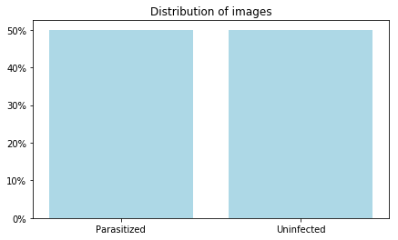
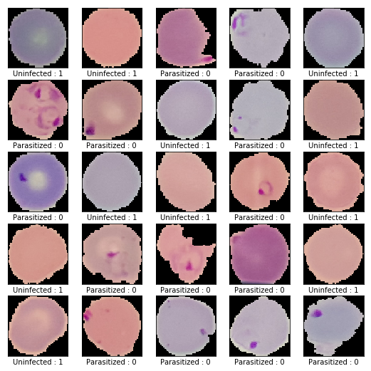
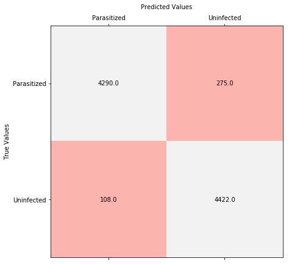
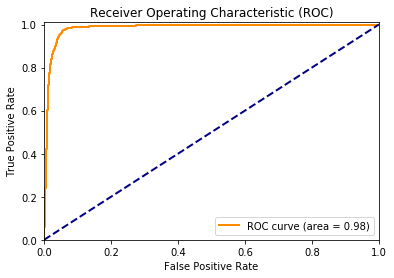

# Malaria Detector

### By Ali Shannon

In this module, I am creating a Malaria detector that uses 27,558 cell images. The dataset is povided by [NIH](https://ceb.nlm.nih.gov/repositories/malaria-datasets/) and made available on [Kaggle](https://www.kaggle.com/iarunava/cell-images-for-detecting-malaria).

---

I will be using Convolutional Neural Networks so I will need a minimal amount of preprocessing. 

First, I will resize the images to 92x92 pixels then store them into numpy arrays of 92x92x3 (for RGB)

Second, I will pass them into a custom network design that has the following configuration:

1. 3x3x3 and 5x5x3 kernels convolutional layers with pooling layers, batch normalizations, and dropouts in between.

2. Two fully connected layers with L2 regularizations.

3. All activations are set to ELU except for the output which uses sigmoid for probability


```python
%matplotlib inline

from PIL import Image
import numpy as np
import matplotlib.pyplot as plt
import tensorflow as tf
from tensorflow import keras
import glob, os

np.random.seed(42) # uniform output across runs

tf.logging.set_verbosity(tf.logging.INFO) #turn off annoying error messages
```


```python
classes = np.array(os.listdir('./'), dtype = 'O')
idx = np.argwhere([classes == '.ipynb_checkpoints', classes == 'Malaria.ipynb'])
classes = np.delete(classes, idx)
```


```python
images = []; filenames = []

for cl in classes:
    for file in glob.glob('{}/*.png'.format(cl)): # import all png images from folder 
        im = Image.open(file) 
        filenames.append(im.filename) # label images
        im = im.resize((92,92)) # resize all images
        images.append(im) # store images
```


```python
X = np.array([np.array(image) for image in images])

labels = []

for file in filenames:
    for class_name in classes:
        if class_name in file:
            labels.append(class_name)
```


```python
from sklearn.preprocessing import LabelEncoder

encoder = LabelEncoder().fit(labels)

y = encoder.transform(labels)
```


```python
unique_vals, counts = np.unique(labels, return_counts = True)

plt.figure(figsize = (7,4))
plt.bar(unique_vals, counts/counts.sum(), color = 'LightBlue');
vals = np.arange(0, 0.52, 0.1)
plt.yticks(vals, ["{:,.0%}".format(x) for x in vals])
plt.title('Distribution of images')
plt.show()
```





Knowing that the dataset is balanced, there is no need to do undersampling.


```python
plt.figure(figsize=(9,9))
for i in range(25):
    plt.subplot(5,5,i+1)
    plt.xticks([])
    plt.yticks([])
    plt.grid(False)
    j = np.random.randint(len(X))
    plt.imshow(X[j], cmap=plt.cm.binary)
    plt.xlabel(labels[j] + ' : ' + str(y[j]))
plt.show()
```





**Normalize all images**

This will simply normalize each image to make the processing a bit simpler.

$$\hat{u}=\frac{\vec{u}}{\|u \|}$$


```python
X_norm = keras.utils.normalize(X)
```

Split into training and testing.


```python
from sklearn.model_selection import train_test_split

X_train, X_test, y_train, y_test = train_test_split(
    X_norm, y, test_size=0.33, random_state=42)
```

This is where the magic happens. With the help of Karas we can easily construct a simple CNN that can be easily configured by tweaking some of the parameters below.


```python
shapes = (92, 92, 3) # input shapes of all images

l2_regularizer = keras.regularizers.l2(0.001) # penalty

model = keras.models.Sequential([
    keras.layers.Conv2D(32, kernel_size=(5, 5), activation='elu', input_shape=shapes),
    keras.layers.AveragePooling2D(pool_size=(2, 2)),
    keras.layers.BatchNormalization(axis = 1),
    keras.layers.Dropout(rate = 0.25), 
    keras.layers.Conv2D(32, kernel_size=(5, 5), activation='elu'),
    keras.layers.AveragePooling2D(pool_size=(2, 2)),
    keras.layers.BatchNormalization(axis = 1),
    keras.layers.Dropout(rate = 0.25),
    keras.layers.Conv2D(32, kernel_size=(3, 3), activation='elu'),
    keras.layers.AveragePooling2D(pool_size=(2, 2)),
    keras.layers.BatchNormalization(axis = 1),
    keras.layers.Dropout(rate = 0.15),
    keras.layers.Flatten(),    
    keras.layers.Dense(128, activation = 'elu', kernel_regularizer = l2_regularizer),
    keras.layers.Dense(32, activation = 'elu', kernel_regularizer = l2_regularizer),
    keras.layers.BatchNormalization(axis = 1),
    keras.layers.Dense(1, activation= 'sigmoid')
])
model.compile(optimizer= 'adam',
            loss='binary_crossentropy',
            metrics=['binary_accuracy'])
```

    WARNING:tensorflow:From D:\ProgramData\Anaconda3\lib\site-packages\tensorflow\python\ops\resource_variable_ops.py:435: colocate_with (from tensorflow.python.framework.ops) is deprecated and will be removed in a future version.
    Instructions for updating:
    Colocations handled automatically by placer.
    WARNING:tensorflow:From D:\ProgramData\Anaconda3\lib\site-packages\tensorflow\python\keras\layers\core.py:143: calling dropout (from tensorflow.python.ops.nn_ops) with keep_prob is deprecated and will be removed in a future version.
    Instructions for updating:
    Please use `rate` instead of `keep_prob`. Rate should be set to `rate = 1 - keep_prob`.
    


```python
model.fit(X_train, y_train, validation_data=(X_test, y_test), epochs = 15, batch_size= 100)
```

    Train on 18463 samples, validate on 9095 samples
    WARNING:tensorflow:From D:\ProgramData\Anaconda3\lib\site-packages\tensorflow\python\ops\math_ops.py:3066: to_int32 (from tensorflow.python.ops.math_ops) is deprecated and will be removed in a future version.
    Instructions for updating:
    Use tf.cast instead.
    Epoch 1/15
    18463/18463 [==============================] - 41s 2ms/sample - loss: 0.8848 - binary_accuracy: 0.6580 - val_loss: 0.8906 - val_binary_accuracy: 0.5636
    Epoch 2/15
    18463/18463 [==============================] - 31s 2ms/sample - loss: 0.5256 - binary_accuracy: 0.8451 - val_loss: 0.6030 - val_binary_accuracy: 0.8288
    Epoch 3/15
    18463/18463 [==============================] - 30s 2ms/sample - loss: 0.2861 - binary_accuracy: 0.9354 - val_loss: 0.2466 - val_binary_accuracy: 0.9430
    Epoch 4/15
    18463/18463 [==============================] - 31s 2ms/sample - loss: 0.2226 - binary_accuracy: 0.9492 - val_loss: 0.2471 - val_binary_accuracy: 0.9487
    Epoch 5/15
    18463/18463 [==============================] - 31s 2ms/sample - loss: 0.1965 - binary_accuracy: 0.9517 - val_loss: 0.1769 - val_binary_accuracy: 0.9612
    Epoch 6/15
    18463/18463 [==============================] - 30s 2ms/sample - loss: 0.1831 - binary_accuracy: 0.9529 - val_loss: 0.1793 - val_binary_accuracy: 0.9569
    Epoch 7/15
    18463/18463 [==============================] - 30s 2ms/sample - loss: 0.1749 - binary_accuracy: 0.9541 - val_loss: 0.2103 - val_binary_accuracy: 0.9513
    Epoch 8/15
    18463/18463 [==============================] - 30s 2ms/sample - loss: 0.1687 - binary_accuracy: 0.9549 - val_loss: 0.1985 - val_binary_accuracy: 0.9535
    Epoch 9/15
    18463/18463 [==============================] - 30s 2ms/sample - loss: 0.1683 - binary_accuracy: 0.9535 - val_loss: 0.1616 - val_binary_accuracy: 0.9598
    Epoch 10/15
    18463/18463 [==============================] - 30s 2ms/sample - loss: 0.1614 - binary_accuracy: 0.9558 - val_loss: 0.1817 - val_binary_accuracy: 0.9571
    Epoch 11/15
    18463/18463 [==============================] - 30s 2ms/sample - loss: 0.1567 - binary_accuracy: 0.9572 - val_loss: 0.1635 - val_binary_accuracy: 0.9596
    Epoch 12/15
    18463/18463 [==============================] - 30s 2ms/sample - loss: 0.1619 - binary_accuracy: 0.9551 - val_loss: 0.1568 - val_binary_accuracy: 0.9600
    Epoch 13/15
    18463/18463 [==============================] - 30s 2ms/sample - loss: 0.1570 - binary_accuracy: 0.9562 - val_loss: 0.1610 - val_binary_accuracy: 0.9563
    Epoch 14/15
    18463/18463 [==============================] - 30s 2ms/sample - loss: 0.1553 - binary_accuracy: 0.9567 - val_loss: 0.1542 - val_binary_accuracy: 0.9598
    Epoch 15/15
    18463/18463 [==============================] - 30s 2ms/sample - loss: 0.1519 - binary_accuracy: 0.9561 - val_loss: 0.1624 - val_binary_accuracy: 0.9579
    


    <tensorflow.python.keras.callbacks.History at 0x25345b75668>


```python
loss, accuracy = model.evaluate(X_test, y_test)

y_pred = model.predict(X_test)
```

    9095/9095 [==============================] - 6s 667us/sample - loss: 0.1624 - binary_accuracy: 0.9579
    

Display the 2x2 confusion matrix.


```python
from sklearn.metrics import confusion_matrix

conf = confusion_matrix(y_test, [np.round(v) for v in y_pred])

fig, ax = plt.subplots(figsize = (7,7))
ax.matshow(conf, cmap='Pastel1')

ax.set_ylabel('True Values')
ax.set_xlabel('Predicted Values', labelpad = 10)
ax.xaxis.set_label_position('top') 


ax.set_yticks(range(len(classes)))
ax.set_xticks(range(len(classes)))
ax.set_yticklabels(encoder.classes_)
ax.set_xticklabels(encoder.classes_)


for (i, j), z in np.ndenumerate(conf):
    ax.text(j, i, '{:0.1f}'.format(z), ha='center', va='center')

plt.show()
```





```python
from sklearn.metrics import roc_curve, auc

fpr, tpr, _ = roc_curve(y_test, y_pred)

roc_auc = auc(fpr, tpr)
```


```python
plt.figure()
lw = 2
plt.plot(fpr, tpr, color='darkorange',
         lw=lw, label='ROC curve (area = %0.2f)' % roc_auc)
plt.plot([0, 1], [0, 1], color='navy', lw=lw, linestyle='--')
plt.xlim([0.0, 1.0])
plt.ylim([0.0, 1.01])
plt.xlabel('False Positive Rate')
plt.ylabel('True Positive Rate')
plt.title('Receiver Operating Characteristic (ROC)')
plt.legend(loc="lower right")
plt.show()

print('Precision =', conf[0][0]/(conf[0][0]+conf[1][0]))
print('Recall =', conf[0][0]/(conf[0][0]+conf[0][1]))
```





    Precision = 0.975443383356071
    Recall = 0.9397590361445783
    

This model optimizes precision, which means it produces less false positives. However, for Malaria detection, we might benefit more from recall which is essentially the measure of sensitivity of our model.
